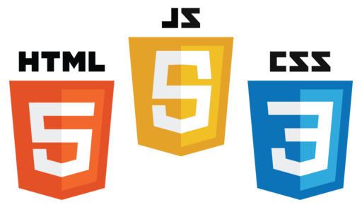

# FrontEndMentor | Social Media Dashboard

  

## Welcome 👋
This is a junior challenge at [***frontendmentor***](https://www.frontendmentor.io). There are 3 levels of challenges at [***frontendmentor***](https://www.frontendmentor.io) **Junior**, **Intermediate** and **Hard**. Junior are beginner friendly challgenges which test your basics of HTML5, CSS3, Responsive Design and JS. Intermediate challenges are modern layout with fully implemented website (3-4) pages. Hard are the crucial testers of your knowledge with Front-end basics like responsive design, optimal layout rendering etc This challenge illustrates the following functionalities
1. Users should be able to view the optimal layout for the site depending on their device's screen size
2. See hover states for all interactive elements on the page
3. Toggle color theme from **Dark** to **Light**

## Table of contents
- [About this Challenge](#About)
- [Technical Specification](#TechSpec)
- [Grid Specification](#GridSpec)
- [Names Spaces (BEM)](#NameSpaces)
- [Implementation](#Implementation)
- [Deploy (Live)](#Deploy)

## About the Project
The main objective of this challenge is to build out this Social Media Dashboard and get it looking as close to the design as possible. The design of this challenge is very intriguing as it has a variant color pallette and theming

## TechSpec

## GridSpec
